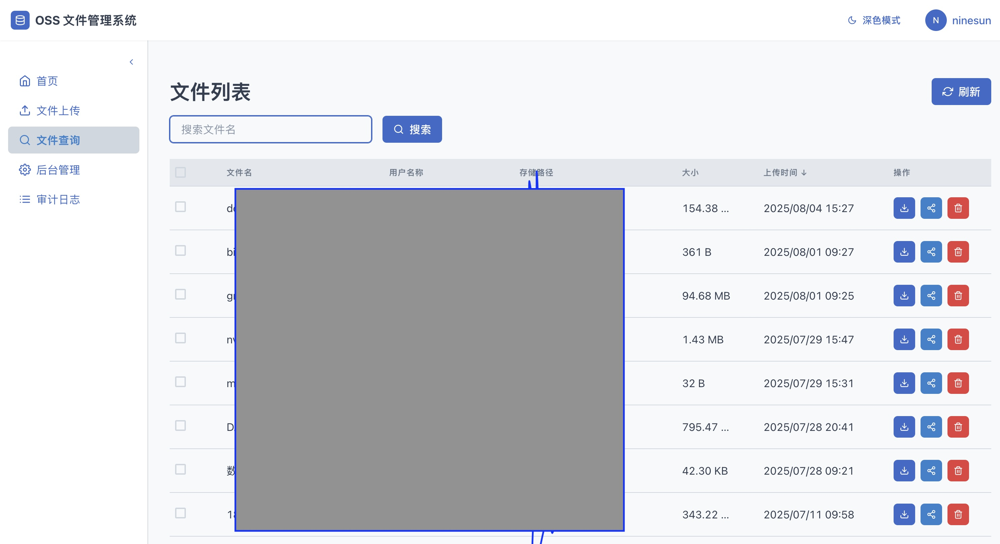
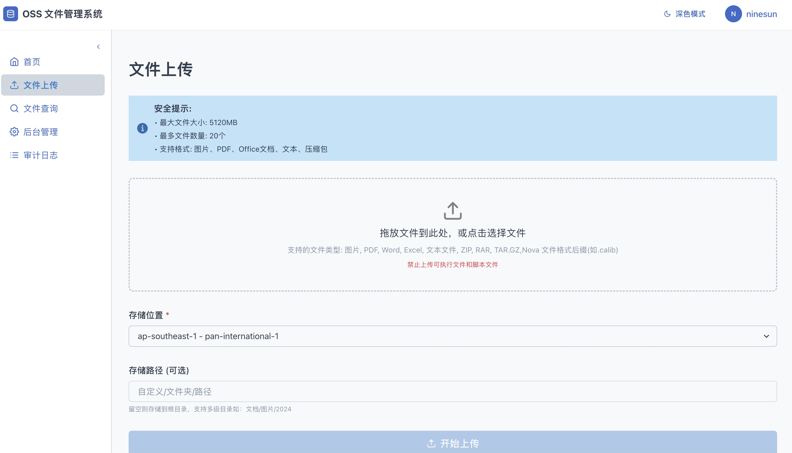
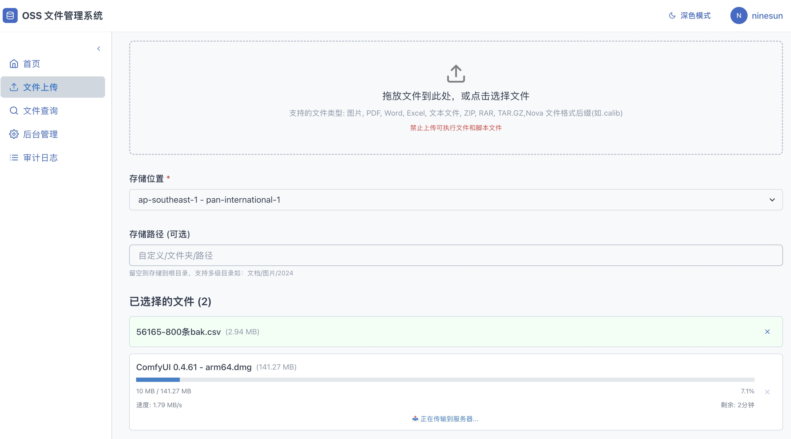
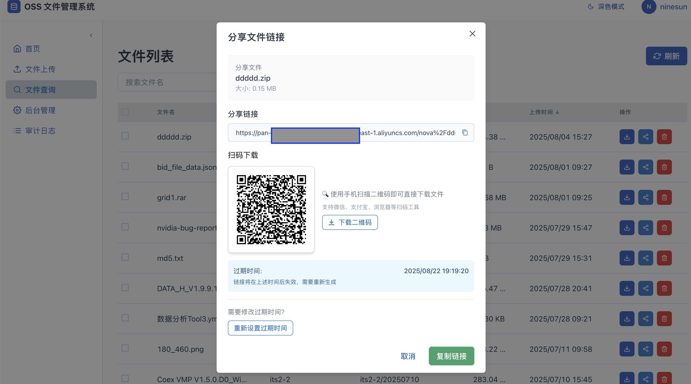
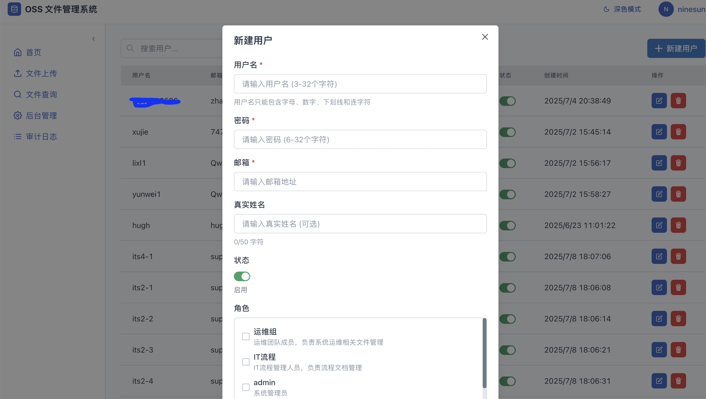
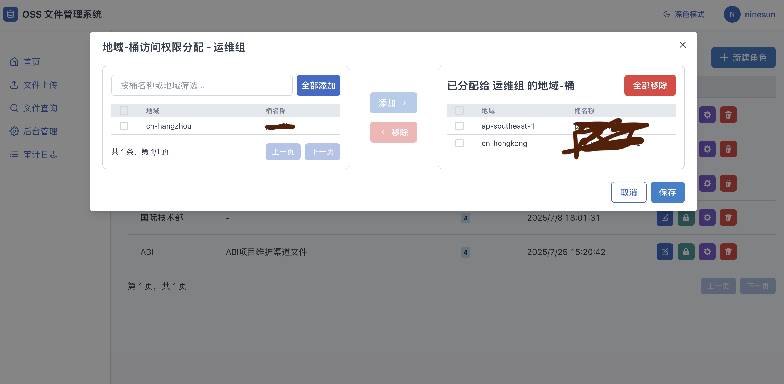
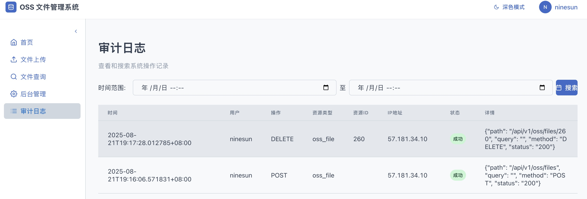
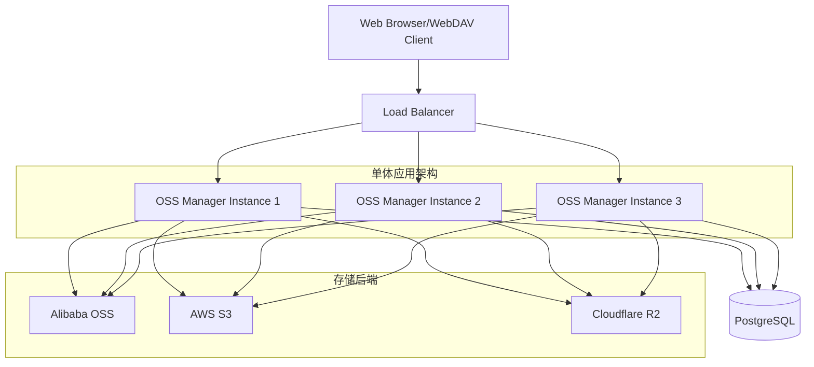

<div align="center">
  <h1>🗄️ OSS Manager</h1>
  <p><em>Modern Object Storage Management Platform</em></p>
  
  [](https://golang.org)
  [](https://nextjs.org)
  [](https://tools.ietf.org/html/rfc4918)
  [](LICENSE)
  [](https://github.com/myysophia/ossmanager/actions)
  [](https://hub.docker.com/r/myysophia/ossmanager)
  
  <p>🚀 <strong>统一的对象存储管理系统</strong> - 支持阿里云OSS、AWS S3、CloudFlare R2等多种云存储服务</p>
  <p>🏗️ <strong>单体应用架构</strong> - 前后端集成，单文件部署，零依赖运行</p>
  
  
  
  <h3>🗂️ WebDAV 文件浏览器</h3>
  
</div>

## 📸 系统截图

### 🖥️ 核心功能界面展示

| 功能模块 | 界面截图 | 功能描述 |
|---------|---------|----------|
| **📁 文件查询** |  | 文件查询和浏览界面，支持多条件搜索和文件预览 |
| **📤 文件上传** |  | 支持拖拽上传、批量上传和实时进度显示 |
| **⚡ 分片上传** |  | 大文件分片上传和断点续传，提升上传效率 |
| **🔗 文件分享** |  | 生成安全的分享链接，支持访问权限和过期时间设置 |

### 🛠️ 管理功能界面展示

| 功能模块 | 界面截图 | 功能描述 |
|---------|---------|----------|
| **👥 用户管理** |  | 基于RBAC的用户权限管理，支持角色分配和细粒度权限控制 |
| **☁️ 存储管理** |  | 多云存储桶统一管理，支持阿里云OSS、AWS S3、CloudFlare R2 |
| **📊 审计日志** |  | 完整的操作审计日志记录，支持日志查询和导出功能 |

---

## 特性

### 🚀 核心功能
- **多云存储支持** - 阿里云OSS、AWS S3、CloudFlare R2
- **WebDAV支持** - 通过文件管理器直接访问云存储
- **用户权限管理** - 基于RBAC的细粒度权限控制
- **文件管理** - 上传、下载、删除、预览
- **分片上传** - 支持大文件分片上传和断点续传
- **MD5校验** - 异步文件完整性验证
- **审计日志** - 完整的操作审计记录

### 🏗️ 技术架构
- **单体应用** - 前后端集成，单文件部署
- **嵌入式前端** - 静态资源嵌入到二进制文件  
- **Go后端** - 高性能、低内存占用
- **React前端** - 现代化Web界面

## 📊 技术栈

<div align="center">
  
  
  
  
  
  
  
  
  
  
  
  
  
</div>

## ⚡ 性能指标

| 指标 | 分离架构 | 单体架构 | 提升 |
|------|---------|----------|------|
| 部署时间 | 15分钟 | 30秒 | **96%** |
| 启动时间 | 45秒 | 18秒 | **60%** |
| 内存占用 | 512MB | 256MB | **50%** |
| Docker镜像大小 | 1.2GB | 45MB | **96%** |
| 运维复杂度 | 高 | 低 | **显著降低** |

## 快速开始

### 📋 系统要求

- Go 1.24+
- Node.js 18+ (仅构建时需要)
- PostgreSQL 14+
- 云存储账号 (阿里云OSS、AWS S3 或 CloudFlare R2)

### 🚀 一键运行

```bash
# 1. 从源码构建
git clone https://github.com/myysophia/ossmanager.git
cd ossmanager

# 2. 安装依赖并构建
make deps
make all

# 3. 配置
cp configs/app.example.yaml configs/app.yaml
cp configs/oss.example.yaml configs/oss.yaml
# 编辑配置文件...

# 4. 启动应用
./build/ossmanager
```

应用启动后：
- Web界面: http://localhost:8080
- API接口: http://localhost:8080/api/v1
- WebDAV: http://localhost:8080/webdav/{bucket}

### 🛠️ 开发模式

```bash
# 启动开发服务器
make dev

# 监控文件变化
make watch
```

## 构建选项

```bash
# 基础构建
make all                 # 构建完整项目
make clean              # 清理构建产物
make frontend           # 仅构建前端
make backend            # 仅构建后端

# 开发相关
make dev                # 启动开发服务器
make watch              # 监控文件变化
make test               # 运行测试
make fmt                # 代码格式化
make lint               # 代码检查

# 部署相关
make build-prod         # 生产环境构建
make backend-cross      # 跨平台构建
make docker             # Docker 镜像构建
make release            # 创建发布包

# 工具相关
make deps               # 安装依赖
make install-tools      # 安装开发工具
make help               # 显示帮助信息
```

## 🐳 Docker 部署

```bash
# 构建镜像
make docker

# 运行容器
docker run -d \
  --name ossmanager \
  -p 8080:8080 \
  -v ./configs:/app/configs \
  -v ./data:/data \
  ossmanager:latest
```

### Docker Compose

```yaml
version: '3.8'
services:
  ossmanager:
    image: myysophia/ossmanager:latest
    ports:
      - "8080:8080"
    volumes:
      - ./configs:/app/configs
      - ./data:/data
    environment:
      - DB_HOST=postgres
      - DB_NAME=ossmanager
      - DB_USER=ossmanager
      - DB_PASSWORD=your_password
    depends_on:
      - postgres
      
  postgres:
    image: postgres:14
    environment:
      POSTGRES_DB: ossmanager
      POSTGRES_USER: ossmanager
      POSTGRES_PASSWORD: your_password
    volumes:
      - postgres_data:/var/lib/postgresql/data
      
volumes:
  postgres_data:
```

## ☸️ Kubernetes 部署

### 基础部署

```yaml
apiVersion: apps/v1
kind: Deployment
metadata:
  name: ossmanager
spec:
  replicas: 3
  selector:
    matchLabels:
      app: ossmanager
  template:
    metadata:
      labels:
        app: ossmanager
    spec:
      containers:
      - name: ossmanager
        image: myysophia/ossmanager:latest
        ports:
        - containerPort: 8080
        env:
        - name: DB_HOST
          value: "postgres-service"
        - name: DB_NAME
          value: "ossmanager"
        volumeMounts:
        - name: config
          mountPath: /app/configs
      volumes:
      - name: config
        configMap:
          name: ossmanager-config
---
apiVersion: v1
kind: Service
metadata:
  name: ossmanager-service
spec:
  selector:
    app: ossmanager
  ports:
  - protocol: TCP
    port: 80
    targetPort: 8080
  type: LoadBalancer
```

### Helm Chart 部署

```bash
# 添加 Helm 仓库
helm repo add ossmanager https://charts.ossmanager.io
helm repo update

# 安装
helm install my-ossmanager ossmanager/ossmanager \
  --set image.tag=latest \
  --set ingress.enabled=true \
  --set ingress.hostname=oss.yourdomain.com
```

## WebDAV 使用

OSS Manager 提供完整的 WebDAV 支持，让您通过标准文件管理器直接访问云存储。

### 🚀 快速开始

#### WebDAV 文件浏览器（推荐）

1. **登录系统**：访问 `http://your-server:8080` 并登录
2. **进入浏览器**：导航到 "WebDAV" → "浏览器" 页面
3. **选择存储桶**：从下拉菜单中选择要访问的存储桶
4. **即时访问**：浏览器内直接管理文件，无需额外配置
5. **外部客户端**：可选择创建访问令牌用于第三方客户端

#### 传统 WebDAV 客户端

1. **获取访问令牌**：在 Web 界面的 "WebDAV 访问管理" 页面创建访问令牌
2. **WebDAV 地址**：`http://your-server:8080/webdav/{bucket-name}`
3. **认证方式**：
   - **Basic Auth**：用户名 + WebDAV 令牌
   - **Bearer Token**：JWT Token（用于 API 集成）

### 💻 支持的客户端

- **Windows**：文件资源管理器、WinSCP
- **macOS**：Finder、命令行 mount
- **Linux**：davfs2、cadaver
- **跨平台**：Cyberduck、FileZilla
- **移动端**：WebDAV Navigator（iOS/Android）

### 📖 详细配置指南

完整的挂载示例、认证配置和故障排查，请参阅：
**[📄 WebDAV 使用指南](docs/webdav-usage.md)**

包含内容：
- 各平台详细挂载步骤
- Token 与 Basic Auth 使用示例  
- 常见故障排查 FAQ
- 性能优化建议
- 安全配置指南

## 📋 API 文档

### 认证 API

```bash
# 用户登录
POST /api/v1/auth/login
Content-Type: application/json

{
  "username": "admin",
  "password": "password"
}

# 响应
{
  "token": "eyJhbGciOiJIUzI1NiIsInR5cCI6IkpXVCJ9...",
  "user": {
    "id": 1,
    "username": "admin",
    "role": "admin"
  }
}
```

### 文件管理 API

```bash
# 获取文件列表
GET /api/v1/files?bucket=my-bucket&prefix=folder/
Authorization: Bearer <token>

# 上传文件
POST /api/v1/files/upload
Authorization: Bearer <token>
Content-Type: multipart/form-data

# 下载文件
GET /api/v1/files/download?bucket=my-bucket&key=file.jpg
Authorization: Bearer <token>

# 删除文件
DELETE /api/v1/files?bucket=my-bucket&key=file.jpg
Authorization: Bearer <token>
```

### 存储桶管理 API

```bash
# 获取存储桶列表
GET /api/v1/buckets
Authorization: Bearer <token>

# 创建存储桶
POST /api/v1/buckets
Authorization: Bearer <token>
Content-Type: application/json

{
  "name": "new-bucket",
  "region": "us-east-1",
  "provider": "aws"
}
```

## 🏛️ 系统架构



### 架构特点

- **🎯 单体应用**: 前后端集成，简化部署和运维
- **📊 水平扩展**: 支持多实例负载均衡
- **🔄 多云支持**: 统一接口管理不同云存储
- **🛡️ 安全认证**: JWT + RBAC 权限控制
- **📁 WebDAV**: 标准协议，兼容各种客户端

## 项目结构

```
ossmanager/
├── cmd/server/          # 主程序入口
├── internal/            # 内部包
│   ├── api/            # API路由和处理器
│   │   ├── handlers/   # HTTP处理器
│   │   ├── middleware/ # 中间件
│   │   └── router.go   # 路由配置
│   ├── auth/           # 认证模块
│   ├── config/         # 配置管理
│   ├── db/             # 数据库层
│   │   ├── models/     # 数据模型
│   │   └── migrations/ # 数据库迁移
│   ├── embed/          # 静态文件嵌入
│   ├── oss/            # 存储服务
│   │   ├── alibaba/    # 阿里云OSS
│   │   ├── aws/        # AWS S3
│   │   └── cloudflare/ # Cloudflare R2
│   └── webdav/         # WebDAV支持
├── web/                # 前端源码
│   ├── src/           # React源码
│   ├── public/        # 静态资源
│   └── build/         # 构建产物
├── configs/            # 配置文件模板
├── docs/               # 文档和示例
├── scripts/            # 构建脚本
├── build/              # 构建产物
├── Dockerfile          # Docker构建
├── docker-compose.yml  # Compose配置
├── Makefile           # 构建脚本
└── README.md          # 项目说明
```

## 🔐 安全说明

### 认证和授权
- **JWT Token**: 使用 JWT 进行用户认证，支持 Token 过期和刷新
- **RBAC权限**: 基于角色的访问控制，支持细粒度权限管理
- **API 安全**: 所有敏感操作都需要有效的认证 Token
- **WebDAV 认证**: 支持 Basic Auth 和 Bearer Token 两种认证方式

### 数据安全
- **密码加密**: 用户密码使用 bcrypt 加密存储
- **传输加密**: 生产环境建议使用 HTTPS
- **文件完整性**: 支持 MD5 校验确保文件完整性
- **审计日志**: 记录所有关键操作用于安全审计

### 部署安全建议
```bash
# 1. 使用强密码
export DB_PASSWORD="$(openssl rand -base64 32)"
export JWT_SECRET="$(openssl rand -base64 64)"

# 2. 限制网络访问
# 仅允许必要端口对外开放
firewall-cmd --add-port=8080/tcp --permanent

# 3. 使用 HTTPS
# 配置 SSL/TLS 证书
ssl_certificate /path/to/cert.pem;
ssl_certificate_key /path/to/key.pem;

# 4. 定期更新
# 及时更新到最新版本修复安全漏洞
git pull origin main && make build
```

## 🚀 性能调优

### 数据库优化
```sql
-- 创建索引提升查询性能
CREATE INDEX idx_files_bucket_key ON files(bucket_name, object_key);
CREATE INDEX idx_audit_logs_created_at ON audit_logs(created_at);
CREATE INDEX idx_users_username ON users(username);

-- 配置连接池
export DB_MAX_OPEN_CONNS=25
export DB_MAX_IDLE_CONNS=5
export DB_CONN_MAX_LIFETIME=300s
```

### 应用配置
```yaml
# configs/app.yaml
server:
  read_timeout: 30s
  write_timeout: 30s
  idle_timeout: 120s
  max_header_bytes: 1048576

cache:
  enabled: true
  ttl: 300s
  max_entries: 10000

upload:
  max_file_size: 5368709120  # 5GB
  chunk_size: 10485760       # 10MB
  concurrent_uploads: 3
```

### 监控指标
- **响应时间**: API 响应时间监控
- **吞吐量**: 每秒请求数 (RPS)
- **错误率**: 4xx/5xx 错误比例
- **资源使用**: CPU、内存、磁盘使用率
- **存储统计**: 上传/下载流量、文件数量

## 🤝 贡献指南

我们欢迎各种形式的贡献！请阅读以下指南：

### 开发环境设置

```bash
# 1. Fork 项目并克隆
git clone https://github.com/your-username/ossmanager.git
cd ossmanager

# 2. 安装开发依赖
make install-tools
make deps

# 3. 启动开发环境
make dev

# 4. 运行测试
make test
make test-coverage
```

### 代码规范

```bash
# 代码格式化
make fmt

# 代码检查
make lint

# 运行完整检查
make check
```

### 提交规范

我们使用 [Conventional Commits](https://www.conventionalcommits.org/) 规范：

```bash
# 功能新增
git commit -m "feat: add support for Azure Blob Storage"

# Bug 修复  
git commit -m "fix: resolve WebDAV authentication issue"

# 文档更新
git commit -m "docs: update API documentation"

# 性能优化
git commit -m "perf: optimize file upload performance"
```

### Pull Request 流程

1. **创建功能分支**: `git checkout -b feature/your-feature-name`
2. **开发和测试**: 确保所有测试通过
3. **更新文档**: 如果需要，更新相关文档
4. **提交 PR**: 提供清晰的描述和测试说明
5. **代码审查**: 响应审查意见并进行修改
6. **合并**: 审查通过后将被合并到主分支

### 问题报告

遇到 Bug 或有功能建议？请通过 [GitHub Issues](https://github.com/myysophia/ossmanager/issues) 报告：

- **Bug 报告**: 请包含复现步骤、期望行为、实际行为和环境信息
- **功能请求**: 请详细描述需求场景和预期功能
- **安全问题**: 请发送邮件到 security@ossmanager.io

## 📜 许可证

MIT License - 查看 [LICENSE](LICENSE) 文件了解详情。

```
Copyright (c) 2024 OSS Manager Contributors

Permission is hereby granted, free of charge, to any person obtaining a copy
of this software and associated documentation files (the "Software"), to deal
in the Software without restriction, including without limitation the rights
to use, copy, modify, merge, publish, distribute, sublicense, and/or sell
copies of the Software...
```

## 🙋‍♂️ 支持与社区

### 获取帮助
- **📖 文档**: [https://docs.ossmanager.io](https://docs.ossmanager.io)
- **💬 讨论**: [GitHub Discussions](https://github.com/myysophia/ossmanager/discussions)
- **🐛 问题**: [GitHub Issues](https://github.com/myysophia/ossmanager/issues)
- **📧 邮件**: support@ossmanager.io

### 社区
- **⭐ Star**: 如果项目对你有帮助，请给我们一个 Star！
- **🔄 Fork**: 欢迎 Fork 项目并贡献代码
- **📢 分享**: 将项目分享给更多需要的人
- **💝 赞助**: 通过 [GitHub Sponsors](https://github.com/sponsors/myysophia) 支持项目发展

---

<div align="center">
  
  **感谢使用 OSS Manager！**
  
  如果这个项目对你有帮助，请考虑给我们一个 ⭐ Star！
  
  Made with ❤️ by [myysophia](https://github.com/myysophia)
  
</div>
