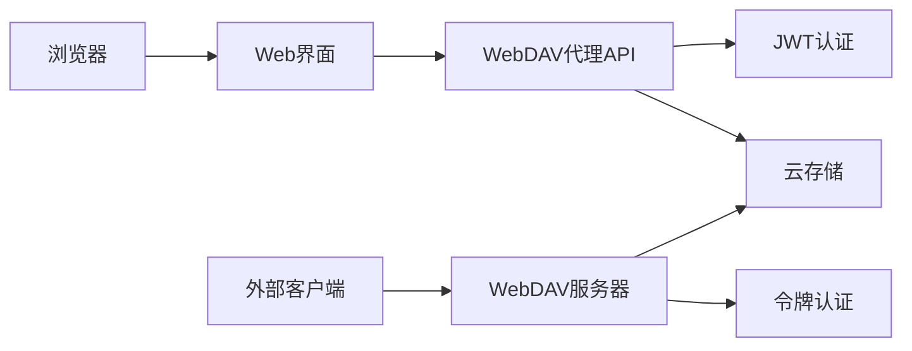

# WebDAV 使用指南

## 概述

OSS Manager 提供完整的 WebDAV 支持，包括现代化的浏览器内文件管理器和传统 WebDAV 客户端支持。您可以通过多种方式访问和管理云存储文件：

- **WebDAV 文件浏览器**：现代化的浏览器内文件管理界面，无需额外配置
- **传统 WebDAV 客户端**：支持标准文件管理器（Windows 文件资源管理器、macOS Finder）
- **第三方客户端**：兼容各种 WebDAV 客户端应用程序
- **API 集成**：提供完整的 RESTful API 用于程序化访问

## WebDAV 文件浏览器（推荐）

### 功能特性

WebDAV 文件浏览器是一个现代化的浏览器内文件管理界面，提供以下核心功能：

- **🚀 即时访问**：登录后直接使用，无需额外配置或令牌设置
- **🔒 自动认证**：使用用户的 JWT Token 自动完成身份验证
- **📁 完整功能**：支持文件浏览、上传、下载、创建文件夹等所有操作
- **🌐 跨平台兼容**：支持所有现代浏览器，包括桌面和移动端
- **⚡ 高性能**：通过代理 API 优化传输，支持大文件和分片上传
- **👥 多存储桶**：一键切换不同存储桶，统一管理界面

### 使用步骤

1. **登录系统**
   - 访问 OSS Manager Web 界面 (`http://your-domain:8080`)
   - 使用您的用户名和密码登录

2. **进入 WebDAV 浏览器**
   - 在主导航栏点击 "WebDAV" 菜单
   - 选择 "浏览器" 子页面

3. **选择存储桶**
   - 从存储桶下拉列表中选择要访问的存储桶
   - 系统会自动显示该存储桶的 WebDAV 连接信息

4. **开始文件管理**
   - 浏览器内直接管理文件和文件夹
   - 支持拖拽上传、批量操作等现代化功能

5. **外部客户端集成（可选）**
   - 如需使用第三方 WebDAV 客户端，可在同一页面创建访问令牌
   - 系统会显示完整的连接配置信息

### 技术架构



**优势对比**：
- ✅ **浏览器访问**：无需安装软件，即开即用
- ✅ **自动认证**：使用现有登录状态，安全便捷
- ✅ **现代界面**：响应式设计，用户体验优秀
- ✅ **功能完整**：支持所有文件操作和批量处理

## 传统 WebDAV 客户端

### 快速开始

#### 1. 获取访问凭据

在 OSS Manager 管理界面：
1. 导航到 **WebDAV 访问管理** 页面
2. 点击 **创建新令牌** 按钮
3. 选择要访问的存储桶
4. 设置令牌过期时间（最长30天）
5. 复制生成的访问令牌

### 2. 获取 WebDAV 地址

WebDAV 访问地址格式：
```
http(s)://your-domain/webdav/{bucket-name}
```

例如：
- `http://localhost:8080/webdav/my-bucket`
- `https://oss.company.com/webdav/documents`

## 挂载示例

### Windows 系统

#### 方法一：文件资源管理器挂载

1. 打开 **文件资源管理器**
2. 右键点击 **此电脑**，选择 **映射网络驱动器**
3. 在弹出窗口中：
   - **驱动器**：选择一个可用的驱动器号（如 Z:）
   - **文件夹**：输入 WebDAV 地址，如 `http://your-domain/webdav/bucket-name`
   - 勾选 **使用其他凭据连接**
4. 点击 **完成**
5. 在身份验证对话框中输入：
   - **用户名**：您的 OSS Manager 用户名
   - **密码**：WebDAV 访问令牌

#### 方法二：命令行挂载

使用 `net use` 命令：
```cmd
net use Z: http://your-domain/webdav/bucket-name /user:username token
```

#### Windows 注意事项

- 确保启用了 **WebClient** 服务
- 对于 HTTPS 连接，可能需要修改注册表以支持 Basic Auth
- 某些 Windows 版本可能需要安装额外的 WebDAV 补丁

### macOS 系统

#### 方法一：Finder 连接

1. 打开 **Finder**
2. 按 `Cmd+K` 或选择菜单 **前往** → **连接服务器**
3. 在 **服务器地址** 中输入：`http://your-domain/webdav/bucket-name`
4. 点击 **连接**
5. 选择 **注册用户** 并输入：
   - **名称**：您的用户名
   - **密码**：WebDAV 访问令牌

#### 方法二：命令行挂载

```bash
# 创建挂载点
sudo mkdir /mnt/webdav

# 使用 mount_webdav 命令
mount -t webdav http://your-domain/webdav/bucket-name /mnt/webdav

# 输入用户名和令牌进行身份验证
```

### Linux 系统

#### 使用 davfs2

1. **安装 davfs2**：
   ```bash
   # Ubuntu/Debian
   sudo apt-get install davfs2
   
   # CentOS/RHEL
   sudo yum install davfs2
   
   # Arch Linux
   sudo pacman -S davfs2
   ```

2. **添加用户到 davfs2 组**：
   ```bash
   sudo usermod -a -G davfs2 $USER
   ```

3. **创建挂载点**：
   ```bash
   sudo mkdir /mnt/webdav
   sudo chown $USER:$USER /mnt/webdav
   ```

4. **配置认证信息**：
   ```bash
   echo "http://your-domain/webdav/bucket-name username token" >> ~/.davfs2/secrets
   chmod 600 ~/.davfs2/secrets
   ```

5. **挂载 WebDAV**：
   ```bash
   mount.davfs http://your-domain/webdav/bucket-name /mnt/webdav
   ```

#### 使用 cadaver（命令行客户端）

```bash
# 安装 cadaver
sudo apt-get install cadaver  # Ubuntu/Debian
sudo yum install cadaver      # CentOS/RHEL

# 连接到 WebDAV 服务器
cadaver http://your-domain/webdav/bucket-name
```

进入交互式命令行后，使用以下命令：
- `ls` - 列出文件
- `get filename` - 下载文件
- `put localfile` - 上传文件
- `mkcol dirname` - 创建目录

### 第三方客户端

#### Cyberduck（跨平台）

1. 下载并安装 [Cyberduck](https://cyberduck.io/)
2. 点击 **打开连接**
3. 在下拉菜单中选择 **WebDAV (HTTP/HTTPS)**
4. 配置连接：
   - **服务器**：`your-domain`
   - **端口**：`8080`（HTTP）或 `443`（HTTPS）
   - **路径**：`/webdav/bucket-name`
   - **用户名**：您的用户名
   - **密码**：WebDAV 访问令牌

#### WinSCP（Windows）

1. 下载并安装 [WinSCP](https://winscp.net/)
2. 新建会话，选择 **WebDAV** 协议
3. 配置连接：
   - **主机名**：`your-domain`
   - **端口号**：`8080`（HTTP）或 `443`（HTTPS）
   - **用户名**：您的用户名
   - **密码**：WebDAV 访问令牌

#### FileZilla（跨平台）

1. 下载并安装 [FileZilla](https://filezilla-project.org/)
2. 打开站点管理器
3. 新建站点，配置：
   - **协议**：选择 **FTP - 文件传输协议**，然后在高级选项中启用 **WebDAV**
   - **主机**：`your-domain`
   - **端口**：`8080` 或 `443`
   - **登录类型**：**正常**
   - **用户**：您的用户名
   - **密码**：WebDAV 访问令牌

## 认证方式详解

OSS Manager WebDAV 服务支持两种认证方式：

### 1. Basic Auth 认证

这是标准的用户名/密码认证方式：

```http
Authorization: Basic base64(username:token)
```

**使用场景**：
- 大多数文件管理器
- 标准的 WebDAV 客户端
- 命令行工具

**示例**：
```bash
curl -u "username:token" http://your-domain/webdav/bucket-name/
```

### 2. Bearer Token 认证

使用 JWT Token 进行认证：

```http
Authorization: Bearer your-jwt-token
```

**使用场景**：
- 现代 REST 客户端
- 自定义应用程序
- API 集成

**示例**：
```bash
curl -H "Authorization: Bearer your-jwt-token" \
     http://your-domain/webdav/bucket-name/
```

### Token 管理

- **创建令牌**：在 WebDAV 管理页面创建专用访问令牌
- **过期时间**：令牌最长有效期为30天
- **权限范围**：令牌仅对指定存储桶有效
- **安全性**：令牌采用加密存储，仅在创建时显示一次

## 常见故障排查 FAQ

### Q1: Windows 提示"网络位置无法访问"

**可能原因**：
- WebClient 服务未启动
- 网络连接问题
- 认证信息错误

**解决方法**：
1. 检查 WebClient 服务状态：
   ```cmd
   sc query WebClient
   ```
   如未启动，执行：
   ```cmd
   sc start WebClient
   ```

2. 验证 WebDAV 地址是否正确
3. 确认用户名和令牌无误
4. 尝试使用 HTTP 而非 HTTPS

### Q2: macOS 连接后无法看到文件

**可能原因**：
- 权限问题
- 存储桶为空
- 网络超时

**解决方法**：
1. 检查用户是否有存储桶访问权限
2. 在 Web 界面确认存储桶中有文件
3. 增加网络超时设置
4. 尝试断开重连

### Q3: Linux davfs2 挂载失败

**可能原因**：
- davfs2 未正确安装
- 权限配置错误
- 依赖包缺失

**解决方法**：
1. 重新安装 davfs2：
   ```bash
   sudo apt-get remove davfs2
   sudo apt-get install davfs2
   ```

2. 检查用户组：
   ```bash
   groups $USER  # 应该包含 davfs2
   ```

3. 检查配置文件权限：
   ```bash
   ls -la ~/.davfs2/secrets  # 应该是 600 权限
   ```

### Q4: 上传大文件失败

**可能原因**：
- 文件大小超限
- 网络超时
- 存储空间不足

**解决方法**：
1. 检查服务器文件大小限制配置
2. 使用支持断点续传的客户端
3. 确认存储后端有足够空间
4. 尝试分片上传

### Q5: 认证反复提示

**可能原因**：
- 令牌已过期
- 用户名输入错误
- 令牌复制时包含空格

**解决方法**：
1. 检查令牌过期时间
2. 重新生成新令牌
3. 确保用户名和令牌准确无误
4. 清除客户端保存的旧凭据

### Q6: 文件修改不同步

**可能原因**：
- 客户端缓存问题
- 并发修改冲突
- 网络传输延迟

**解决方法**：
1. 刷新客户端视图
2. 断开重连 WebDAV
3. 避免多客户端同时修改同一文件
4. 检查网络连接稳定性

### Q7: 中文文件名乱码

**可能原因**：
- 字符编码不匹配
- 客户端不支持 UTF-8
- 系统语言设置问题

**解决方法**：
1. 确保客户端支持 UTF-8 编码
2. 检查系统区域设置
3. 使用英文文件名作为临时方案

### Q8: 连接速度慢

**可能原因**：
- 网络带宽限制
- 服务器负载高
- 客户端配置不当

**解决方法**：
1. 检查网络连接质量
2. 尝试不同时间段访问
3. 调整客户端并发连接数
4. 使用有线网络替代 WiFi

## 性能优化建议

### 客户端优化

1. **调整缓存设置**：
   - 增加本地缓存大小
   - 启用预读缓存
   - 合理设置缓存过期时间

2. **网络优化**：
   - 使用有线网络连接
   - 调整 TCP 窗口大小
   - 启用连接复用

3. **并发控制**：
   - 限制同时传输文件数
   - 避免大量小文件操作
   - 使用批量操作接口

### 服务器优化

1. **连接池配置**：
   ```yaml
   webdav:
     max_connections: 100
     timeout: 30s
     keep_alive: true
   ```

2. **缓存策略**：
   - 启用元数据缓存
   - 配置文件内容缓存
   - 使用 Redis 作为缓存后端

## 安全注意事项

1. **传输加密**：
   - 生产环境务必使用 HTTPS
   - 配置有效的 SSL 证书
   - 禁用 HTTP 访问

2. **访问控制**：
   - 定期轮换访问令牌
   - 设置合理的令牌过期时间
   - 及时删除不需要的令牌

3. **审计监控**：
   - 启用 WebDAV 访问日志
   - 监控异常访问行为
   - 定期检查用户权限

4. **防火墙配置**：
   ```bash
   # 只允许特定 IP 访问
   iptables -A INPUT -p tcp --dport 8080 -s trusted-ip -j ACCEPT
   iptables -A INPUT -p tcp --dport 8080 -j DROP
   ```

## 最佳实践

1. **文件组织**：
   - 使用清晰的目录结构
   - 避免深层嵌套
   - 合理命名文件和文件夹

2. **版本管理**：
   - 重要文件定期备份
   - 使用版本控制工具
   - 避免直接修改重要文件

3. **协作管理**：
   - 明确文件所有者
   - 建立修改权限规则
   - 使用锁定机制防止冲突

4. **监控维护**：
   - 定期清理临时文件
   - 监控存储使用量
   - 检查系统性能指标

## WebDAV API 参考

OSS Manager 提供完整的 WebDAV REST API，支持程序化访问和第三方集成。

### API 基础信息

- **基础 URL**: `http://your-domain:8080/api/v1/webdav`
- **认证方式**: JWT Bearer Token
- **内容类型**: `application/json`
- **字符编码**: UTF-8

### 认证

所有 API 请求都需要包含有效的 JWT Token：

```http
Authorization: Bearer your-jwt-token
```

获取 JWT Token：
```bash
curl -X POST http://your-domain:8080/api/v1/auth/login \
  -H "Content-Type: application/json" \
  -d '{
    "username": "your-username",
    "password": "your-password"
  }'
```

### 存储桶管理 API

#### 获取可访问的存储桶列表

```http
GET /api/v1/webdav/buckets
```

**响应示例**：
```json
{
  "success": true,
  "data": [
    "bucket-1",
    "bucket-2",
    "documents"
  ]
}
```

#### 获取存储桶连接信息

```http
GET /api/v1/webdav/buckets/{bucket-name}/connection-info
```

**响应示例**：
```json
{
  "success": true,
  "data": {
    "bucket": "documents",
    "webdav_url": "http://your-domain:8080/webdav/documents",
    "protocol": "http",
    "port": 8080,
    "path": "/webdav/documents",
    "supports_browser_access": true,
    "requires_token_for_external_access": true
  }
}
```

### WebDAV 令牌管理 API

#### 创建访问令牌

```http
POST /api/v1/webdav/tokens
```

**请求体**：
```json
{
  "bucket": "documents",
  "expires_in": 24,
  "description": "客户端访问令牌"
}
```

**响应示例**：
```json
{
  "success": true,
  "data": {
    "id": 123,
    "token": "wdv_1234567890abcdef",
    "bucket": "documents",
    "expires_at": "2024-12-14T10:00:00Z",
    "created_at": "2024-12-13T10:00:00Z",
    "description": "客户端访问令牌"
  }
}
```

#### 获取令牌列表

```http
GET /api/v1/webdav/tokens?bucket={bucket-name}
```

**响应示例**：
```json
{
  "success": true,
  "data": [
    {
      "id": 123,
      "bucket": "documents",
      "expires_at": "2024-12-14T10:00:00Z",
      "created_at": "2024-12-13T10:00:00Z",
      "description": "客户端访问令牌",
      "is_expired": false,
      "last_used_at": "2024-12-13T12:30:00Z"
    }
  ]
}
```

#### 删除令牌

```http
DELETE /api/v1/webdav/tokens/{token-id}
```

### 文件操作代理 API

#### 列出文件和目录

```http
GET /api/v1/webdav/proxy/{bucket-name}/files?prefix={path}
```

**参数**：
- `prefix`: 可选，目录路径前缀
- `limit`: 可选，返回数量限制，默认 100
- `marker`: 可选，分页标记

**响应示例**：
```json
{
  "success": true,
  "data": {
    "files": [
      {
        "name": "document.pdf",
        "path": "folder/document.pdf",
        "size": 1024000,
        "modified_time": "2024-12-13T10:00:00Z",
        "content_type": "application/pdf",
        "is_directory": false
      },
      {
        "name": "subfolder",
        "path": "folder/subfolder/",
        "size": 0,
        "modified_time": "2024-12-13T09:00:00Z",
        "is_directory": true
      }
    ],
    "has_more": false,
    "next_marker": null
  }
}
```

#### 上传文件

```http
POST /api/v1/webdav/proxy/{bucket-name}/upload
```

**请求类型**: `multipart/form-data`

**表单字段**：
- `file`: 文件内容
- `path`: 目标路径
- `overwrite`: 可选，是否覆盖现有文件，默认 false

**响应示例**：
```json
{
  "success": true,
  "data": {
    "path": "folder/uploaded-file.txt",
    "size": 1024,
    "content_type": "text/plain",
    "uploaded_at": "2024-12-13T10:30:00Z",
    "md5": "d41d8cd98f00b204e9800998ecf8427e"
  }
}
```

#### 下载文件

```http
GET /api/v1/webdav/proxy/{bucket-name}/download?path={file-path}
```

**参数**：
- `path`: 文件路径
- `inline`: 可选，是否内联显示，默认 false（下载）

#### 删除文件或目录

```http
DELETE /api/v1/webdav/proxy/{bucket-name}/files?path={file-path}
```

**响应示例**：
```json
{
  "success": true,
  "message": "文件删除成功"
}
```

#### 创建目录

```http
POST /api/v1/webdav/proxy/{bucket-name}/directories
```

**请求体**：
```json
{
  "path": "new-folder/subfolder"
}
```

#### 移动/重命名文件

```http
PUT /api/v1/webdav/proxy/{bucket-name}/move
```

**请求体**：
```json
{
  "source_path": "old-folder/file.txt",
  "destination_path": "new-folder/renamed-file.txt"
}
```

#### 复制文件

```http
PUT /api/v1/webdav/proxy/{bucket-name}/copy
```

**请求体**：
```json
{
  "source_path": "folder/file.txt",
  "destination_path": "backup/file.txt"
}
```

### 统计和监控 API

#### 获取存储桶统计信息

```http
GET /api/v1/webdav/buckets/{bucket-name}/stats
```

**响应示例**：
```json
{
  "success": true,
  "data": {
    "bucket": "documents",
    "total_files": 1250,
    "total_size": 2048576000,
    "last_modified": "2024-12-13T10:30:00Z",
    "file_types": {
      "pdf": 450,
      "docx": 300,
      "txt": 200,
      "images": 150,
      "others": 150
    }
  }
}
```

#### 获取访问日志

```http
GET /api/v1/webdav/logs?bucket={bucket-name}&limit=50
```

**参数**：
- `bucket`: 可选，筛选特定存储桶
- `action`: 可选，筛选操作类型 (read/write/delete)
- `start_time`: 可选，开始时间 (ISO 8601)
- `end_time`: 可选，结束时间 (ISO 8601)
- `limit`: 可选，返回数量，默认 50，最大 500

**响应示例**：
```json
{
  "success": true,
  "data": {
    "logs": [
      {
        "id": 12345,
        "timestamp": "2024-12-13T10:30:00Z",
        "user": "admin",
        "action": "upload",
        "bucket": "documents",
        "path": "folder/file.pdf",
        "size": 1024000,
        "client_ip": "192.168.1.100",
        "user_agent": "Mozilla/5.0..."
      }
    ],
    "total": 1000,
    "has_more": true
  }
}
```

### 错误处理

所有 API 都返回标准的错误格式：

```json
{
  "success": false,
  "error": {
    "code": "INVALID_TOKEN",
    "message": "访问令牌无效或已过期",
    "details": {
      "token_expired_at": "2024-12-13T10:00:00Z"
    }
  }
}
```

**常见错误码**：
- `UNAUTHORIZED`: 未认证或认证失败
- `FORBIDDEN`: 权限不足
- `BUCKET_NOT_FOUND`: 存储桶不存在
- `FILE_NOT_FOUND`: 文件不存在
- `INVALID_TOKEN`: 令牌无效
- `TOKEN_EXPIRED`: 令牌已过期
- `QUOTA_EXCEEDED`: 超出配额限制
- `INVALID_PATH`: 路径格式无效

### SDK 和代码示例

#### JavaScript/TypeScript

```typescript
class WebDAVClient {
  private baseURL: string;
  private token: string;

  constructor(baseURL: string, token: string) {
    this.baseURL = baseURL;
    this.token = token;
  }

  async listFiles(bucket: string, prefix?: string) {
    const url = new URL(`${this.baseURL}/api/v1/webdav/proxy/${bucket}/files`);
    if (prefix) url.searchParams.set('prefix', prefix);
    
    const response = await fetch(url.toString(), {
      headers: {
        'Authorization': `Bearer ${this.token}`
      }
    });
    
    return await response.json();
  }

  async uploadFile(bucket: string, path: string, file: File) {
    const formData = new FormData();
    formData.append('file', file);
    formData.append('path', path);
    
    const response = await fetch(`${this.baseURL}/api/v1/webdav/proxy/${bucket}/upload`, {
      method: 'POST',
      headers: {
        'Authorization': `Bearer ${this.token}`
      },
      body: formData
    });
    
    return await response.json();
  }
}
```

#### Python

```python
import requests
from typing import Optional, Dict, Any

class WebDAVClient:
    def __init__(self, base_url: str, token: str):
        self.base_url = base_url.rstrip('/')
        self.token = token
        self.session = requests.Session()
        self.session.headers.update({
            'Authorization': f'Bearer {token}'
        })
    
    def list_files(self, bucket: str, prefix: Optional[str] = None) -> Dict[str, Any]:
        url = f"{self.base_url}/api/v1/webdav/proxy/{bucket}/files"
        params = {'prefix': prefix} if prefix else {}
        
        response = self.session.get(url, params=params)
        response.raise_for_status()
        return response.json()
    
    def upload_file(self, bucket: str, path: str, file_data: bytes) -> Dict[str, Any]:
        url = f"{self.base_url}/api/v1/webdav/proxy/{bucket}/upload"
        files = {'file': file_data}
        data = {'path': path}
        
        response = self.session.post(url, files=files, data=data)
        response.raise_for_status()
        return response.json()
    
    def create_token(self, bucket: str, expires_in: int = 24) -> Dict[str, Any]:
        url = f"{self.base_url}/api/v1/webdav/tokens"
        data = {
            'bucket': bucket,
            'expires_in': expires_in
        }
        
        response = self.session.post(url, json=data)
        response.raise_for_status()
        return response.json()
```

## 技术支持

如果您在使用 WebDAV 功能时遇到问题，请：

1. 查阅本文档的常见问题部分
2. 检查系统日志获取详细错误信息
3. 通过以下方式获取帮助：
   - GitHub Issues：[项目地址](https://github.com/myysophia/ossmanager/issues)
   - 邮件支持：support@ossmanager.io
   - 社区讨论：[GitHub Discussions](https://github.com/myysophia/ossmanager/discussions)

---

*最后更新：2024年12月*
